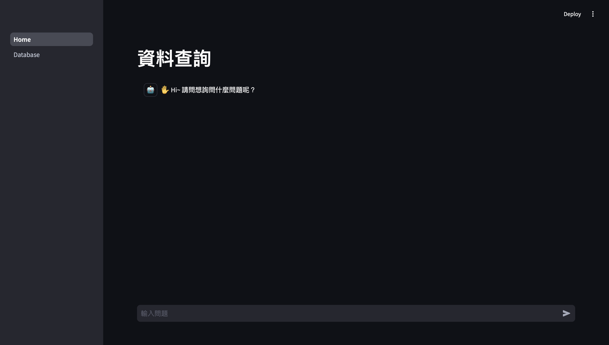

<a id="readme-top"></a>
# RAG（Retrieval-Augmented Generation）with Streamlit


<ol>
  <li><a href="#about-the-project">About The Project</a></li>
  <li><a href="#built-with">Built With</a></li>
  <li><a href="#getting-started">Getting Started</a></li>
  <li><a href="#usage">Usage</a></li>
  <li><a href="#contact">Contact</a></li>
</ol>

## About The Project

This project demonstrates a Retrieval-Augmented Generation (RAG) system utilizing the latest Language Model (LLM) technologies. By leveraging PDF documents as the data source, ChromaDB as the database for efficient retrieval, and Gemma2 2B for language modeling, this project aims to provide high-quality, contextually relevant responses. The embedding model used is All-minilm, deployed by SBERT, ensuring robust vector representations of the data.

Additionally, a user-friendly interface is implemented using Streamlit, allowing users to upload PDF documents and interact with the system through a question-and-answer (Q&A) interface. This interface facilitates seamless document input and enables dynamic, real-time querying of the uploaded content.



<p align="right">(<a href="#readme-top">back to top</a>)</p>

## Built With

* LangChain
* ChromaDB
* Gemma2 2B
* all-MiniLM
* Streamlit
  
<p align="right">(<a href="#readme-top">back to top</a>)</p>

## Getting Started

To get a local copy up and running, follow these simple steps.

1. Create a new conda environment
   ```sh
   conda create --name RAG_Streamlit python=3.11
   ```
   
2. Activate environment
   ```sh
   conda activate RAG_Streamlit
   ```

3. Clone the repo
   ```sh
   git clone https://github.com/Imding1211/RAG_Streamlit.git
   ```
   
4. Change directory
   ```sh
   cd RAG_Streamlit
   ```
   
5. Install the required Python packages
   ```sh
   pip install -r requirements.txt
   ```
   
6. You can install Ollama directly on your computer or build it using Docker as well.
   * [On your computer](https://ollama.com/download)
   * [Using Docker](https://hub.docker.com/r/ollama/ollama)

   If you use Docker to build it, all subsequent commands related to Ollama need to be prefixed with the following command.
   ```
   docker exec -it <container name> <command>
   ```
   Where `container name` should be replaced with your container's name.

7. Activate Ollama
   ```sh
   ollama serve
   ```
   You can open the browser and enter http://127.0.0.1:11434 to check if the Ollama server is operating normally.

8. Download the LLM
   ```sh
   ollama pull gemma2:2b
   ```

9. Download the embedding model
   ```sh
   ollama pull all-minilm
   ```

<p align="right">(<a href="#readme-top">back to top</a>)</p>

## Usage
   
* Run the following command to start the UI.
   ```sh
   streamlit run Home.py
   ```

* You can select the PDF on the Data page and click the update button to import the PDF into the database.


<p align="right">(<a href="#readme-top">back to top</a>)</p>

## Contact

Chi Heng Ting - a0986772199@gmail.com

Project Link - https://github.com/Imding1211/RAG_Streamlit

<p align="right">(<a href="#readme-top">back to top</a>)</p>
